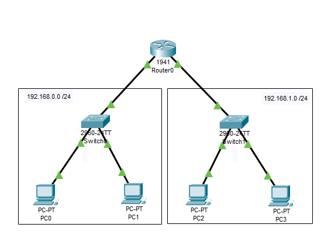

# Interligar redes lógicas diferentes utilizando um roteador
  Esse simples projeto consiste em ligar as redes 192.168.0.0/24 e 192.168.1.0/24 através de um roteador.
 
## Lista de componentes:

- 1  Roteador 1941
- 2 Switches 2960-24TT
- 4 PC-PT

## Esquema do projeto

