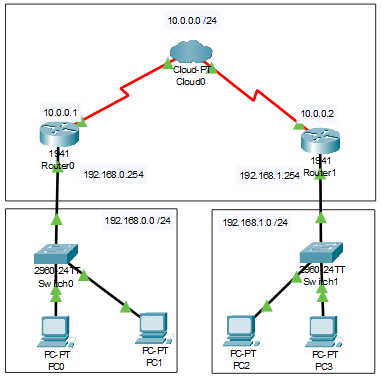

# Conectar 2 redes LAN através da WAN
  Para conectar 2 redes LAN através da WAN é usado uma Cloud que, conectada a roteadores através de cabo serial, irá representar a internet.

Configurando os Roteadores:
- Desligue os roteadores e adicione o módulo de interface de rede de alta largura de banca HWIC-2T (High-speedWAN Interface Card) para conectar o roteador ao CloudPT.
- Use o cabo Serial DTE(Data Terminal Equipament) para realizar a conexão com o roteador.
- Conexão:
  - CloudPT/Serial 0 com Router0/ Serial 0
  - CloudPT/Serial 1 com Router1/ Serial 0 
Documentação da rede:
- Rede: 192.168.0.0
  - PC1 - 192.168.0.1/26 - 255.255.255.0 - Gateway I 192.168.0.254/26
  - PC2 - 192.168.0.2/26 - 255.255.255.0 - Gateway I 192.168.0.254/26
- Rede: 192.168.1.0
  - PC3 - 192.168.1.1/26 - 255.255.255.0 - Gateway II 192.168.1.254/26
  - PC4 - 192.168.1.2/26 - 255.255.255.0 - Gateway II 192.168.1.254/26
- Router0
  - Gigabit 0/0 - 192.168.0.254/26 - 255.255.255.0 - Gateway I
  - Serial 0/0 - 10.0.0.1/26 - 255.0.0.0
- Router1
  - Gigabit 0/0 - 192.168.1.254/26 - 255.255.255.0 - Gateway II
  - Serial 0/0 - 10.0.0.2/26 - 255.0.0.0
- Configurar as interfaces
  - Serial 0 - Rede1 com DLCI 100
  - Serial 1 - Rede2 com DLCI 200
- Configurar o Frame-relay
  - Serial 0 - Rede1 <–> Serial 1 - Rede2
- Configurar o Frame-relay em cada roteador
  - Serial 0/0/0 -> CLI -> digite o comando encapsulationframe-relay.
    
 *É necessário criar caminhos estáticos em ambos os roteadores! (EX2)*
 
## Lista de componentes:

- 2 Switches 2960-24TT
- 4 PC-PT
- 2 Roteadores 1941
- 1 Cloud-PT

## Esquema do projeto

