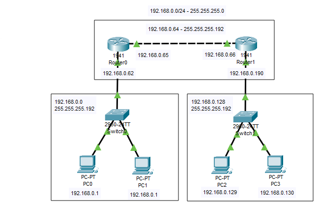

# Criação de subredes e roteamento estático
  Criar a comunicação das redes 192.168.0.0/26 e 192.168.0.128/26 através da rede 192.168.0.62.
  Os roteadores são ligados por um cabo cross-over pelas portas Gigabit0/1 em ambos os roteadores.
  
 - Rede I 192.168.0.0 
    PC0-192.168.0.1 -255.255.255.192 Gateway 192.168.0.62 
    PC1-192.168.0.2 -255.255.255.192 Gateway 192.168.0.62 
 - Rede II 192.168.0.128 
    PC2-192.168.0.129 -255.255.255.192 Gateway 192.168.0.190 
    PC3-192.168.0.130 -255.255.255.192 Gateway 192.168.0.190
 - Rede III 192.168.0.64 
    Router0 
      Gigabit 0/0 -192.168.0.62 -255.255.255.192 
      Gigabit 0/1 -192.168.0.65 -255.255.255.192 
    Router1 
      Gigabit 0/0  -192.168.0.190 -255.255.255.192 
      Gigabit 0/1 -192.168.0.66 -255.255.255.192 

  É necessário criar um caminho estático para que as redes I e II se comuniquem:
  Redes conectadas ao Router0 
    192.168.0.0 -255.255.255.192 
    192.168.0.64 -255.255.255.192 
    Redes não conectadas ao Router0 
      192.168.0.128 -255.255.255.192 
      nexthop 192.168.0.66
  Redes conectadas ao Router1 
    192.168.0.128 -255.255.255.192 
    192.168.0.64 -255.255.255.192 
    Redes não conectadas ao Router1 
      192.168.0.0 -255.255.255.192 
      nexthop 192.168.0.65
      
## Lista de componentes:

- 2  Roteadores 1941
- 2 Switches 2960-24TT
- 4 PC-PT

## Esquema do projeto

