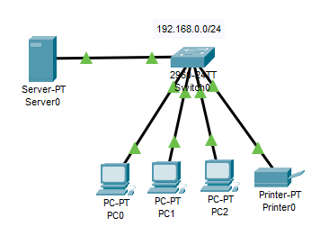

# Distribuição de ips dinâmicos através de um servidor DHCP
  Servidor distribui dinamicamente os ips disponíveis entre os hosts.
  
- Rede I 192.168.0.0 
  - PC0 - DHCP - 255.255.255.0 
  - PC1 - DHCP - 255.255.255.0 
  - PC2 - DHCP - 255.255.255.0 
  - Printer0 - DHCP - 255.255.255.0

- Configuração do Servidor DHCP 
  - Default gateway -192.168.0.1 
  - DNS -192.168.0.1 
  - Start IP 2 (1 é do DHCP) 
  - Maximum 253 (254 é do Broadcast)

      
## Lista de componentes:

- 1  Server-PT
- 1 Switches 2960-24TT
- 3 PC-PT
- 1 Printer-PT

## Esquema do projeto

