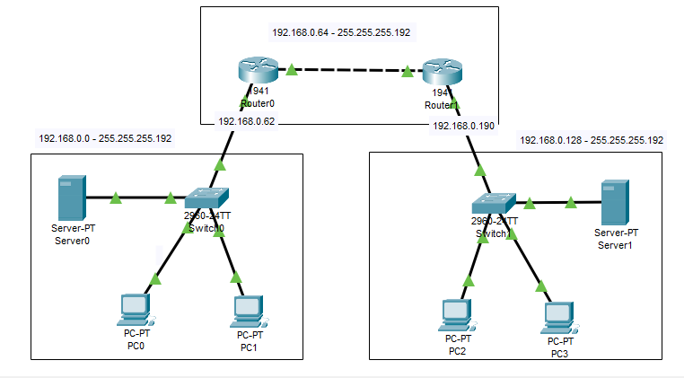

# Conectando subredes que utilizam protocólo DHCP
  2 subredes que possuem IPs de hosts distribuidos dinâmicamente conectadas através de 2 roteadores.
  
- Rede I 192.168.0.0 
  - PC0 - DHCP - 255.255.255.192 
  - PC1 - DHCP - 255.255.255.192 
  - Server 0 - 192.168.0.1 - 255.255.255.192 Gateway 192.168.0.62
- Rede II 192.168.0.128
  - PC2 - DHCP - 255.255.255.192
  - PC3 - DHCP - 255.255.255.192 
  - Server 1 - 192.168.0.129 - 255.255.255.192 Gateway 192.168.0.190
- Rede III 192.168.0.64
  - Router0
    - Gigabit 0/0 -192.168.0.62 -255.255.255.192
    - Gigabit 0/1 -192.168.0.65 -255.255.255.192
  - Router1
    - Gigabit 0/0 -192.168.0.190 -255.255.255.192
    - Gigabit 0/1 -192.168.0.66 -255.255.255.192

- Configuração dos Servidores DHCP
  - Server 0 
    - Default gateway - 192.168.0.62 
    - DNS -192.168.0.1 
    - Start IP 2  
    - Maximum 62 
  - Server 1
    - Default gateway - 192.168.0.190 
    - DNS - 192.168.0.129
    - Start IP 130  
    - Maximum 62

*É necessario criar um caminho estático como mostrado no exercício 2*
      
## Lista de componentes:

- 2 Server-PT
- 2 Roteadores 1941
- 2 Switches 2960-24TT
- 4 PC-PT
  

## Esquema do projeto

