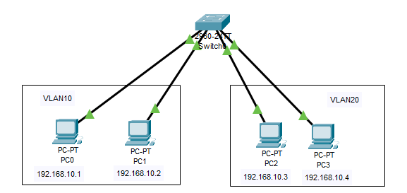

# Criação de 2 VLAN em um Switch
  2 redes VLAN (10 - VLAN10; 20 - VLAN20) em um mesmo Switch. O objetivo é fazer com que apenas as maquinas na mesma VLAN se comuniquem.

  VLANS para as interfaces: 
  - 10 – VLAN10
    - FastEthernet0/1
    - FastEthernet0/2 
  - 20 - VLAN20
    - FastEthernet0/24
    - FastEthernet0/23

  IPs de Hosts:
  - PC0 - 192.168.10.1 - 255.255.255.0
  - PC1 - 192.168.10.2 - 255.255.255.0
  - PC2 - 192.168.10.3 - 255.255.255.0
  - PC3 - 192.168.10.4 - 255.255.255.0

  *É necessário criar as VLANS na aba VLAN Database no Switch!*
      
## Lista de componentes:

- 1 Switches 2960-24TT
- 4 PC-PT
  

## Esquema do projeto

