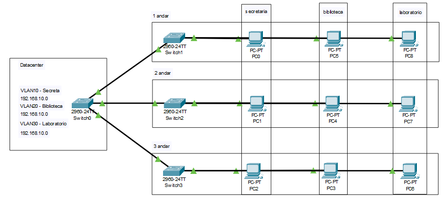

# Criação de 3 VLAN em um Switch
  3 VLAN (Secretaria - VLAN10; Biblioteca - VLAN20; Laboratório - VLAN30) em um mesmo Switch. O objetivo é fazer com que apenas as maquinas na mesma VLAN (setores) se comuniquem.

  Conectar o Switch0 aos outros Switchs:
  - TRUNK
    - FastEthernet0/1 - GigabitEthernet0/1 - Switch1
    - FastEthernet0/2 - GigabitEthernet0/1 - Switch2
    - FastEthernet0/3 - GigabitEshernet0/1 - Switch3

  Conectar os Hosts aos Switchse e especificar a VLAN de suas portas:
  - Switch1 - Access
    - PC0 -FastEthernet0/1 – VLAN10
    - PC1 -FastEthernet0/2 – VLAN20
    - PC2 -FastEthernet0/3 – VLAN30
  - Switch2 - Access
    - PC3 -FastEthernet0/1 – VLAN10
    - PC4 -FastEthernet0/2 – VLAN20
    - PC5 -FastEthernet0/3 – VLAN30
  - Switch3 - Access
    - PC6 -FastEthernet0/1 – VLAN10
    - PC7 -FastEthernet0/2 – VLAN20
    - PC8 -FastEthernet0/3 – VLAN30

  *É necessário criar as VLANS na aba VLAN Database no Switch0!*
      
## Lista de componentes:

- 4 Switches 2960-24TT
- 9 PC-PT
  

## Esquema do projeto

