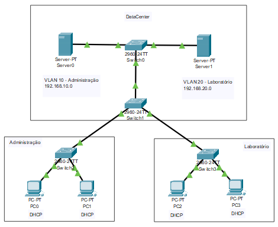

# Criação de 2 VLANs e a conexão entre os servidores DHCP do Data Center
  2 VLANs onde os hosts recebem seus endereços IP através do protocólo DHCP.

Configuração de IPs:
- Servidores
  - Server 0 - 192.168.10.1/24 - Gateway 192.168.10.1 de Início em 2 e máximo 254
  - Server 1 - 192.168.20.1/24 - Gateway 192.168.20.1 de Início em 2 e máximo 254
- Hosts
  - Rede 192.168.10.0 - ADMINISTRAÇÃO
    - PC0 - DHCP
    - PC1 - DHCP
  - Rede 192.168.20.0 - LABORATÓRIO
    - PC2 - DHCP
    - PC3 - DHCP

Criação das VLANS em todos os switchs (10 – ADMINISTRAÇÃO; 20 – LABORATÓRIO) e especificar os acessos as VLANS para as interfaces:
- Switch 1
  - FastEthernet0/1 - Access
    - 10 - VLAN10
  - FastEthernet0/2 - Access
    - 10 - VLAN10
  - FastEthernet0/3 - Access
    - 10 - VLAN10
- Switch 2
  - FastEthernet0/1 - Access
    - 20 - VLAN20
  - FastEthernet0/2 - Access
    - 20 - VLAN20
  - FastEthernet0/3 - Access
    - 20 - VLAN20
- Switch 3
  - FastEthernet0/1 - Trunk
    - 10 - VLAN10
    - 20 - VLAN20
  - FastEthernet0/2 - Access
    - 10 – VLAN10
  - FastEthernet0/3 - Access
    - 20 - VLAN20
- Switch 4
  - FastEthernet0/1 - Trunk
    - 10 – VLAN10
    - 20 - VLAN20
  - FastEthernet0/2 - Access
    - 10 – VLAN10
  - FastEthernet0/3 - Access
    - 20 -VLAN20

  *É necessário criar as VLANS na aba VLAN Database nos Switches!*
      
## Lista de componentes:

- 4 Switches 2960-24TT
- 4 PC-PT
- 2 Servidores
  

## Esquema do projeto

