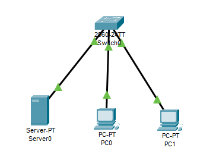
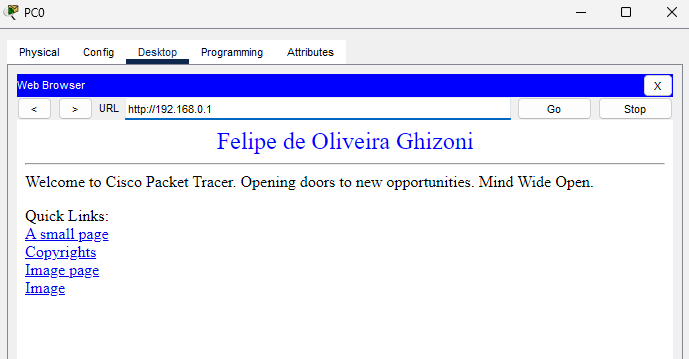

# Criar um servidor WEB configurando DHCP e DNS
  Acessar uma pagina HTML em um servidor DNS.

Passo a Passo:
- Servidor DHCP
  - DNS Server - 192.168.0.1
  - Sart IP Address - 192.168.0.2
- Hosts
  - PC0 - DHCP
  - PC1 - DHCP
- Servidor DNS
  - Na aba Services do servidor procure por HTTP e acesse Index.html, la altere a página do servidor web adicionando o seu nome ao título da página.
  - Na aba Services do servidor procure por DNS e configure o servidor DNS para acessar o endereço ip do servidor por www.ambientes.com onde adress será 192.168.0.1. 
 
## Lista de componentes:

- 1 Switches 2960-24TT
- 2 PC-PT
- 1 Servidores
  
*É necessário configurar o servidor DHCP*

## Esquema do projeto

